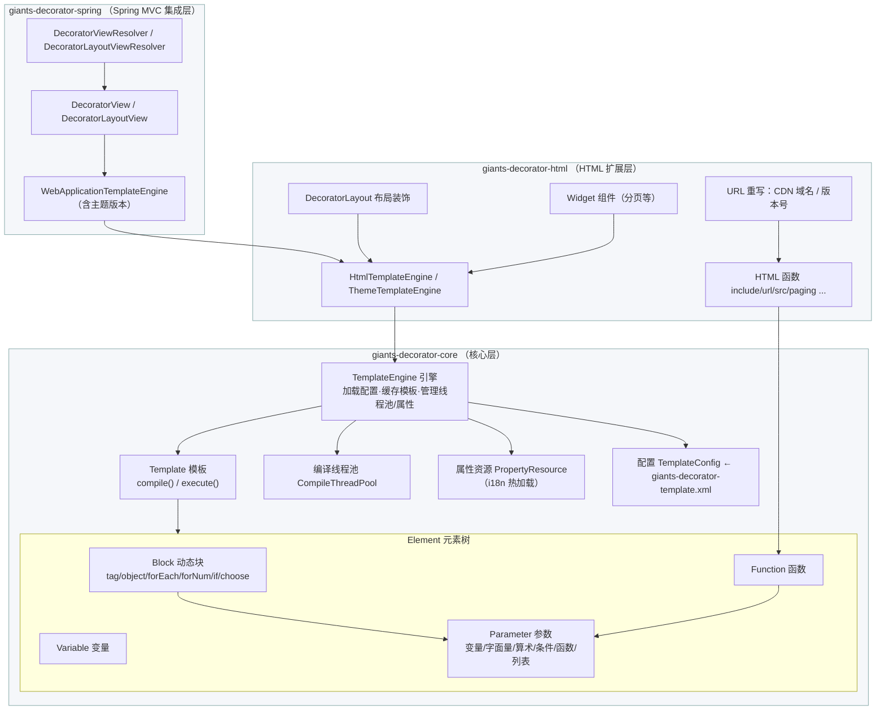
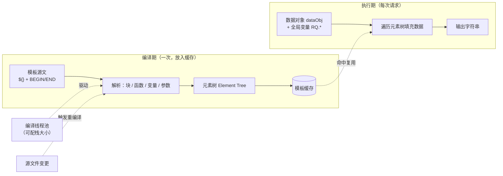

Giants-Decorator 使用手册
========================

> 版本：1.3.1
> 适用模块：`giants-decorator-core` / `giants-decorator-html` / `giants-decorator-spring`

Giants-Decorator 是一个基于 Java 的模板引擎（template engine）。它使用简单、直观的模板语言引用由 Java 代码定义的对象，模板编译与执行分离，运行速度快。模板使用 HTML 注释（`<!-- BEGIN ... -->` / `<!-- END ... -->`）标记动态块，用 `${}` 标记输出占位符，与 HTML 语法完全兼容，能在普通浏览器或编辑器中正确显示，无需任何第三方模板插件即可实现所见即所得。

本手册面向使用者，完整介绍模板语言语法、内置动态块与函数、Java 引擎 API、HTML 扩展模块以及 Spring MVC 集成方式。

---

目录
----

- [1. 快速开始](#1-快速开始)
- [2. 核心概念](#2-核心概念)
  - [2.1 整体架构](#21-整体架构)
  - [2.2 编译与执行分离](#22-编译与执行分离)
- [3. 模板语言语法](#3-模板语言语法)
  - [3.1 输出占位符 `${}`](#31-输出占位符-)
  - [3.2 变量与属性取值](#32-变量与属性取值)
  - [3.3 字面量](#33-字面量)
  - [3.4 算术表达式](#34-算术表达式)
  - [3.5 条件表达式](#35-条件表达式)
  - [3.6 全局变量 `RQ.`](#36-全局变量-rq)
  - [3.7 复杂表达式转义 `#[]`](#37-复杂表达式转义-)
- [4. 动态块（Block）](#4-动态块block)
  - [4.1 块的通用语法](#41-块的通用语法)
  - [4.2 tag](#42-tag)
  - [4.3 object](#43-object)
  - [4.4 forEach](#44-foreach)
  - [4.5 forNum](#45-fornum)
  - [4.6 if](#46-if)
  - [4.7 choose / when / otherwise](#47-choose--when--otherwise)
  - [4.8 var 与数据作用域](#48-var-与数据作用域)
  - [4.9 块的嵌套](#49-块的嵌套)
- [5. 内置函数（core）](#5-内置函数core)
- [6. Java 引擎 API](#6-java-引擎-api)
- [7. 配置文件详解](#7-配置文件详解)
- [8. HTML 模块](#8-html-模块)
- [9. Spring MVC 集成](#9-spring-mvc-集成)
- [10. 扩展开发](#10-扩展开发)
- [11. 异常一览](#11-异常一览)

---

## 1. 快速开始

### 引入依赖

```xml
<dependency>
    <groupId>com.github.vencent-lu</groupId>
    <artifactId>giants-decorator-core</artifactId>
    <version>1.3.1</version>
</dependency>
```

如果需要 HTML 布局/主题能力，引入 `giants-decorator-html`；如果集成 Spring MVC，再引入 `giants-decorator-spring`（会传递依赖 core 与 html）。

### 编写模板

`hello.html`：

```html
<h1>你好，${user.name}</h1>
<!-- BEGIN if : test=user.vip -->
<p>尊贵的 VIP 用户</p>
<!-- END if -->
<ul>
<!-- BEGIN forEach : items=user.orders var="order" -->
    <li>${order.id} - ${numberFormat(order.amount,'0.00')} 元</li>
<!-- END forEach -->
</ul>
```

### 渲染模板

```java
import com.giants.decorator.core.engine.file.FileTemplateEngine;
import com.giants.decorator.core.Template;

// basePath：模板根目录；relativeBasePath：相对子目录（可为空）
FileTemplateEngine engine = new FileTemplateEngine("/app/templates", "");

Template template = engine.loadTemplate("hello.html");

Map<String, Object> data = new HashMap<>();
data.put("user", user);          // 任意 JavaBean 或 Map
String html = template.execute(data);
```

`FileTemplateEngine` 加载出来的是 `AutoCompileTemplate`，会在首次执行时自动编译，并在模板文件发生变更后自动重新编译，无需手动调用 `compile()`。

---

## 2. 核心概念

| 概念 | 说明 |
| --- | --- |
| **模板引擎 TemplateEngine** | 负责加载配置、加载/缓存模板、创建元素与参数、管理编译线程池与属性资源。 |
| **模板 Template** | 一份模板文件或一段模板内容，提供 `compile()` 与 `execute(...)`。 |
| **元素 Element** | 模板中被解析出来的可执行单元，分为「变量/函数」与「动态块」两类。 |
| **动态块 Block** | 用 `<!-- BEGIN xxx -->...<!-- END xxx -->` 标记的结构，如循环、条件。 |
| **函数 Function** | `${funcName(...)}` 形式的调用，对数据做转换、格式化等处理。 |
| **参数 Parameter** | 块属性与函数入参的取值表达式，可以是变量、字面量、算术、条件、函数等。 |
| **编译与执行分离** | 模板首次使用时解析为元素树并缓存（编译），后续执行只做数据填充，速度快。 |

**编译在独立线程池中进行**（可配置栈大小），以减少运行时线程栈占用；执行阶段是无状态的数据填充。

### 2.1 整体架构

Giants-Decorator 采用「核心 + 扩展」的分层结构：`core` 提供模板语言与引擎基座，`html` 在其上叠加 HTML/布局/主题能力，`spring` 再把 html 引擎桥接进 Spring MVC。三者依赖方向单向向下。



### 2.2 编译与执行分离

模板首次被使用时先**编译**成可复用的元素树并放入缓存；之后每次**执行**只是遍历元素树、把数据填进去，因此渲染开销很低。文件模板（`AutoCompileTemplate`）还会在源文件变更后自动触发重新编译。



> 纯文本概览（不支持 Mermaid 渲染时）：
>
> ```
> spring  ─┐  ViewResolver → View → WebApplicationTemplateEngine
>          │
> html    ─┤  HtmlTemplateEngine · DecoratorLayout · HTML函数 · Widget · URL重写
>          │
> core    ─┘  TemplateEngine → Template → [Block · Function · Variable → Parameter]
>              └ 编译线程池 · 属性资源 · TemplateConfig(XML)
>
> 处理链：模板源 →(编译:解析→元素树→缓存) →(执行:数据填充→输出)
> ```

---

## 3. 模板语言语法

### 3.1 输出占位符 `${}`

用 `${表达式}` 输出一个值到模板中。表达式可以是变量、属性、算术、条件、函数调用或它们的组合。

```html
${title}
${user.name}
${order.amount + 10}
${dateFormat(now,'yyyy-MM-dd')}
```

`${}` 内允许嵌套花括号（如函数参数里的 Map 字面量 `{k:v}`），引擎能正确处理嵌套。

### 3.2 变量与属性取值

- 使用点号 `.` 逐级访问 Bean 属性或 Map 键：`${user.address.city}`。
- 底层通过 JavaBean 属性（getter）或 `Map.get(key)` 取值；任一层级为 `null` 时整个表达式返回 `null`。
- 布尔取反：在变量名前加 `!`，如 `${!user.disabled}`（要求该变量为 `Boolean`）。

> 空白与点号在解析时会被规整，`user . name` 与 `user.name` 等价。

### 3.3 字面量

| 类型 | 写法 | 示例 |
| --- | --- | --- |
| 字符串 | 单引号或双引号 | `'active'`、`"admin"` |
| 整数 | 可带负号 | `10`、`-5` |
| 小数 | 可带负号 | `3.14`、`-0.5` |
| 布尔 | 关键字 | `true`、`false` |
| 空值 | 关键字 | `null` |
| Map | `{key:value,...}` | `{pageNo:1,size:20}` |
| List | `[...]` | `[a,b,c]` |

### 3.4 算术表达式

支持 `+ - * / %`，`*` `/` `%` 优先级高于 `+` `-`，可用小括号 `()` 分组。

```html
${price * quantity}
${(a + b) * c}
${total / count}
${index % 2}
```

### 3.5 条件表达式

单条件比较运算符：

| 运算符 | 含义 | 适用 |
| --- | --- | --- |
| `==` | 相等 | 数字按值比较；对象要求类型相同且 `equals` 为真 |
| `!=` | 不相等 | 同上取反 |
| `>` `>=` `<` `<=` | 大小比较 | 仅数字类型 |
| ` is null` / ` not null` | 判空 | 判断对象是否为 `null` |
| ` is empty` / ` not empty` | 判空串 | 针对字符串判断空/非空 |

```html
<!-- BEGIN if : test=user.age >= 18 -->成年<!-- END if -->
<!-- BEGIN if : test=status == 'active' -->启用<!-- END if -->
<!-- BEGIN if : test=user.name is empty -->未填写姓名<!-- END if -->
<!-- BEGIN if : test=user.address not null -->有地址<!-- END if -->
```

多条件逻辑运算符：`&&`、`||`，也支持关键字 `and`、`or`。

```html
<!-- BEGIN if : test=#[user.age > 18 && user.vip] -->成年 VIP<!-- END if -->
<!-- BEGIN if : test=#[isAdmin || isOwner] -->有管理权限<!-- END if -->
```

> `==` 对对象比较要求「**类型相同**」，例如 `Integer` 与 `Long` 不判等；数字之间的 `==`/`!=`/大小比较会自动做数值换算。

### 3.6 全局变量 `RQ.`

通过 `execute(Map<String,Object> globalVarMap, Object dataObj)` 的第一个参数传入的全局变量，用前缀 `RQ.` 引用，不受当前块数据作用域影响：

```html
${RQ.contextPath}/static/logo.png
<!-- BEGIN if : test=RQ.currentUser.admin -->...<!-- END if -->
```

在 HTML/Spring 场景中，`HtmlHelper.addRequestToGlobalVarMap(...)` 会把 request 相关信息放进全局变量（见 [第 8 节](#8-html-模块)）。

### 3.7 复杂表达式转义 `#[]`

块参数（`name=value`）的取值默认不允许包含空格、冒号 `:`、比较/逻辑运算符等字符——因为它们是块语法本身的分隔符。当参数值是一个包含这些字符的复杂表达式时，用 `#[ ... ]` 包裹起来：

```html
<!-- BEGIN if : test=#[pageNo > 1 && pageNo < totalPage] -->
    ...
<!-- END if -->
```

简单值（单个变量、字面量、无空格的比较）可以不加 `#[]`，如 `test=user.vip`、`test=status=='active'`。当表达式里含有空格、`||`、`&&`、`:`（如函数里的 Map 参数）等，务必用 `#[]` 包裹以保证解析正确。

---

## 4. 动态块（Block）

### 4.1 块的通用语法

```html
<!-- BEGIN 块名 : 参数1=值1 : 参数2=值2 -->
    块体内容
<!-- END 块名 -->
```

- `BEGIN`、`END` 前后空白可任意；参数之间用冒号 `:` 分隔。
- 结束标记的块名必须与开始标记完全一致。
- 同名块可以嵌套，引擎按配对深度正确匹配。

下面逐一说明 core 内置块。

### 4.2 tag

最简单的容器块，不做任何逻辑，仅用于分组或占位。

```html
<!-- BEGIN tag -->
    <div>固定区块</div>
<!-- END tag -->
```

### 4.3 object

将某个对象设为块体的数据对象，块体内可直接引用该对象的属性。

| 参数 | 类型 | 必填 | 说明 |
| --- | --- | --- | --- |
| `value` | Object | 是 | 作为块体数据对象的表达式 |

```html
<!-- BEGIN object : value=order.customer var="c" -->
    客户：${c.name} / ${c.phone}
<!-- END object -->
```

### 4.4 forEach

遍历集合、数组或 `Map`（遍历其 `values()`）。

| 参数 | 类型 | 必填 | 说明 |
| --- | --- | --- | --- |
| `items` | Object | 否 | 要遍历的集合/数组/Map；**省略时默认遍历当前数据对象** |
| `var` | String | 否 | 当前元素的变量名（详见 [4.8](#48-var-与数据作用域)） |
| `varStatus` | String | 否 | 迭代状态变量名 |

`varStatus` 对象提供以下属性：

| 属性 | 类型 | 含义 |
| --- | --- | --- |
| `index` | Integer | 当前下标（从 0 开始） |
| `count` | Integer | 元素总数 |
| `first` | Boolean | 是否第一个 |
| `last` | Boolean | 是否最后一个 |

```html
<!-- BEGIN forEach : items=users var="u" varStatus="st" -->
    <div class="${st.first ? '' : ''}">
        ${st.index}. ${u.name}
        <!-- BEGIN if : test=st.last -->（末尾）<!-- END if -->
    </div>
<!-- END forEach -->
```

> 若不指定 `var`，当前元素的属性会被「摊平」到块体作用域，可直接用 `${属性名}` 访问（元素为 Map 或 Bean 时）。指定 `var` 后，用 `${var名.属性}` 访问，更清晰、也可避免与外层字段冲突。

### 4.5 forNum

数值循环，从 `start` 到 `end`（**含两端**），步长为 1。

| 参数 | 类型 | 必填 | 说明 |
| --- | --- | --- | --- |
| `start` | Long | 是 | 起始值 |
| `end` | Long | 是 | 结束值 |
| `var` | String | 否 | 当前数值的变量名 |

当前循环值本身就是数据对象（一个 `Long`）。**通常需要用 `var` 命名**才能在块体中引用它：

```html
<!-- BEGIN forNum : start=1 : end=5 var="n" -->
    <span>第 ${n} 页</span>
<!-- END forNum -->
```

### 4.6 if

条件为真时渲染块体。`if` 与 `when` 使用同一处理器。

| 参数 | 类型 | 必填 | 说明 |
| --- | --- | --- | --- |
| `test` | Boolean | 是 | 布尔条件表达式 |

```html
<!-- BEGIN if : test=#[cart.itemCount > 0] -->
    <a href="/checkout">结算（${cart.itemCount}）</a>
<!-- END if -->
```

### 4.7 choose / when / otherwise

多分支选择，类似 `switch`。`choose` 内必须至少有一个 `when`，`otherwise` 可选，命中第一个为真的 `when` 后即停止。

```html
<!-- BEGIN choose -->
    <!-- BEGIN when : test=score >= 90 -->优秀<!-- END when -->
    <!-- BEGIN when : test=score >= 60 -->及格<!-- END when -->
    <!-- BEGIN otherwise -->不及格<!-- END otherwise -->
<!-- END choose -->
```

### 4.8 var 与数据作用域

每个块在渲染块体前都会决定「块体看到的数据对象」：

- **不设 `var`**：块的操作对象（如 forEach 的当前元素、object 的 value）会与外层数据合并——若为 Map 直接并入键值；若为 Bean 则将其属性拷贝为键值。块体可直接引用这些属性。
- **设 `var="x"`**：操作对象整体绑定到变量 `x`，同时外层数据仍可访问。块体用 `${x}` 或 `${x.属性}` 引用。
- **`varStatus`**（仅 forEach）：迭代状态以额外变量注入，与上面的作用域规则叠加。

推荐在 `forEach`、`forNum`、`object` 中显式使用 `var`，语义清晰且避免命名冲突。

### 4.9 块的嵌套

块可以任意嵌套，内层块自动继承外层块处理后的数据作用域：

```html
<!-- BEGIN forEach : items=categories var="cat" -->
    <h3>${cat.name}</h3>
    <!-- BEGIN forEach : items=cat.products var="p" -->
        <!-- BEGIN if : test=p.onSale -->
            <span class="sale">${p.title}</span>
        <!-- END if -->
    <!-- END forEach -->
<!-- END forEach -->
```

---

## 5. 内置函数（core）

函数调用语法：`${函数名(参数,...)}`。参数可用「位置」或表达式传入；含冒号的 Map 参数请放在 `${}` 内（`${}` 支持嵌套花括号）。

| 函数 | 参数（必填标注*） | 说明 / 返回 |
| --- | --- | --- |
| `strLimit` | `string`*, `threshold`*(Integer), `postfix` | 超过 `threshold` 长度则截断并追加 `postfix` |
| `strFormat` | `string`*, `arguments`*(Map) | 用 `arguments` 替换 `string` 中的 `{key}` 占位 |
| `replace` | `value`*, `replaceMap`*(Map) | 按 `value` 在 map 中取映射值；支持 `other` 作为兜底 |
| `dateFormat` | `date`*(Date), `format`*(String) | 按 `SimpleDateFormat` 模式格式化日期 |
| `currentDateTime` | 无 | 返回当前 `java.util.Date` |
| `addDateTime` | `date`*(Date), `calendarField`*(String), `increment`*(Integer) | 对日期字段做增减；字段取 `y/M/d/E/H/m/s/S` |
| `numberFormat` | `num`*(Number), `format`*(String) | 按 `DecimalFormat` 模式格式化数字 |
| `valueOf` | `type`*(String), `value`*(String) | 把字符串转为指定类型：`int/long/float/double/short/byte/string` |
| `collectionUnion` | `arrayList`*(List) | 合并多个集合/对象为一个 `Collection` |
| `listUnion` | `arrayList`*(List) | 合并多个 List/对象为一个 `List` |
| `size` | `value`* | 返回字符串长度 / 集合或数组大小；其它对象返回 1 |
| `getArrayElement` | `value`*, `index`*(Integer) | 取 List/数组指定下标元素 |
| `toString` | `object` | 转字符串，`null` 返回 `null` |
| `contains` | `collection`*(Collection), `object`* | 集合是否包含元素，返回 `Boolean` |
| `jsonObject` | `object`* | 用 FastJSON 序列化为 JSON 字符串 |
| `getProperty` | `key`*(String) | 从属性资源（i18n/properties）中取值 |

示例：

```html
${strLimit(article.title, 20, '...')}
${dateFormat(order.createTime, 'yyyy-MM-dd HH:mm')}
${numberFormat(product.price, '#,##0.00')}
${replace(order.status, {1:'待付款',2:'已付款','other':'未知'})}
${size(cart.items)}
${getProperty('site.title')}
```

> HTML 模块还提供 `include`、`url`、`src`、`paging` 等函数，见 [第 8 节](#8-html-模块)。

---

## 6. Java 引擎 API

### 6.1 两种引擎

| 引擎 | 模板来源 | 典型场景 |
| --- | --- | --- |
| `FileTemplateEngine`（core）/ `HtmlFileTemplateEngine`（html） | 文件系统 | 模板以文件形式存放在磁盘目录 |
| `ExtTemplateEngine`（core）/ `HtmlExtTemplateEngine`（html） | 自定义 `TplService` | 模板来自数据库、远程服务等 |

构造方法（两者一致）：

```java
public FileTemplateEngine(String basePath,
                          String relativeBasePath,
                          String... configFile)
```

- `basePath`：模板根目录。
- `relativeBasePath`：相对子目录（可为空字符串）。
- `configFile`：可选的额外配置文件；框架自带的 `META-INF/giants-decorator-template.xml` 总是会被自动加载并合并。

也可用无参构造后调用 `initConfig(basePath, relativeBasePath, configFile...)`。

### 6.2 加载与渲染

```java
// 加载（并缓存）模板
Template template = engine.loadTemplate("user/profile.html");

// 渲染：仅数据对象
String out1 = template.execute(dataObj);

// 渲染：全局变量 + 数据对象（全局变量用 ${RQ.xxx} 引用）
String out2 = template.execute(globalVarMap, dataObj);
```

- `dataObj` 可以是任意 JavaBean 或 `Map<String,Object>`。
- `FileTemplateEngine.loadTemplate` 返回 `AutoCompileTemplate`，首次 `execute` 会自动编译，源文件变更后自动重编译。
- `engine.removeTemplate(name)` 可移除缓存。

### 6.3 直接用字符串内容渲染

无需文件时，可用 `ContentTemplate`：

```java
Template t = new ContentTemplate(engine, "inline", "订单 #${id}：${numberFormat(amount,'0.00')}");
t.compile();
String out = t.execute(data);
```

### 6.4 属性 / i18n

```java
engine.setProperty("site.title", "我的站点");
String v = engine.getProperty("site.title");
```

在模板中用 `${getProperty('site.title')}` 读取。也可通过配置 `propertyResource` 指定 `.properties` 文件，引擎会后台定时（约 60 秒）检测文件变更并热加载。

### 6.5 编译线程池

模板编译在独立的 `ThreadPoolExecutor` 中进行，可在配置里通过 `compileThreadPool` 调整核心/最大线程数、队列长度、空闲回收时间以及**线程栈大小**（减少运行时栈内存占用）。

---

## 7. 配置文件详解

配置文件是一个 `templateConfig` XML，`name="default"` 的配置会作为默认配置被合并。框架内置的 `META-INF/giants-decorator-template.xml` 注册了所有内置块与函数，你的自定义配置文件与之合并。

```xml
<?xml version="1.0" encoding="UTF-8"?>
<templateConfig name="default">

    <!-- 编译线程池 -->
    <compileThreadPool corePoolSize="1" maximumPoolSize="5"
                       keepAliveTime="600" queueSize="10" stackSize="2097152"/>

    <!-- 属性资源（i18n / 配置项），逗号分隔多个文件 -->
    <propertyResource value="messages.properties,site.properties"/>

    <!-- 自定义块：指定块处理器 -->
    <block name="myBlock" tagHandlerClass="com.example.MyBlockHandler">
        <parameter name="value" type="java.lang.Object" allowNull="false"/>
    </block>

    <!-- 自定义函数：指定函数处理器 -->
    <function name="myFunc" tagHandlerClass="com.example.MyFunctionHandler">
        <parameter name="input" type="java.lang.String" allowNull="false"/>
    </function>

    <!-- 布局（html/spring 使用）：按 rules 正则匹配视图名 -->
    <layout name="main" layoutFile="layout/main.html"
            rules=".*" excludeNames="login,error"/>

    <!-- 组件（html 使用） -->
    <widget name="myWidget" widgetFile="classpath:com/example/widget.html"/>

</templateConfig>
```

### 配置元素速查

| 元素 | 关键属性 | 说明 |
| --- | --- | --- |
| `compileThreadPool` | `corePoolSize` / `maximumPoolSize` / `keepAliveTime`（秒） / `queueSize` / `stackSize`（字节） | 编译线程池 |
| `propertyResource` | `value`（逗号分隔的文件名） | 属性/i18n 文件，支持热加载 |
| `block` | `name` / `tagHandlerClass` | 注册动态块及其处理器 |
| `function` | `name` / `tagHandlerClass` | 注册函数及其处理器 |
| `parameter` | `name` / `type` / `allowNull` | 块或函数的参数定义 |
| `blockStructure` | `name` / `blockName` / `multiton` / `required` | 声明子块结构（如 choose 的 when/otherwise） |
| `layout` | `name` / `layoutFile` / `rules` / `excludeNames` | 布局装饰规则 |
| `widget` | `name` / `widgetFile` | 可复用组件模板 |

---

## 8. HTML 模块

`giants-decorator-html` 在 core 之上增加了 HTML 场景能力：布局装饰、主题、组件（widget）、URL 重写（CDN/版本号）以及一批 HTML 专用函数。其内置配置为 `templateConfig name="html-default"`，并带 `conversionRelativeURL="true"`。

### 8.1 引擎类型

| 引擎 | 说明 |
| --- | --- |
| `HtmlFileTemplateEngine` | 文件系统 HTML 模板引擎 |
| `HtmlExtTemplateEngine` | 基于 `TplService` 的 HTML 模板引擎 |
| `ThemeHtmlFileTemplateEngine` | 多主题（`ThreadLocal` 按请求切换主题） |
| `StaticThemeHtmlFileTemplateEngine` | 单主题（应用级固定主题） |
| `ThemeHtmlExtTemplateEngine` / `StaticThemeHtmlExtTemplateEngine` | 对应的 Ext 版本 |

主题 `Theme` 有 `name` 与 `path`；选主题后加载模板会自动在路径前拼接 `theme.getPath()`，例如主题路径为 `themes/blue` 时，加载 `footer.html` 实际读取 `themes/blue/footer.html`。

### 8.2 布局装饰（Layout）

类 SiteMesh 的装饰机制：

1. 控制器返回视图名，如 `user/edit`。
2. `DecoratorLayout` 用配置的 `layout` 规则（`rules` 正则、`excludeNames` 排除）匹配视图名。
3. 命中后加载布局模板（如 `layout/main.html`），并把被装饰的视图名放入全局变量 `currentTemplate`。
4. 布局模板中用 `${include(currentTemplate)}` 把视图内容嵌入布局。

```html
<!-- layout/main.html -->
<!DOCTYPE html>
<html>
<head>
    <title>${getProperty('site.title')}</title>
    ${getHeadTags(currentTemplate)}
</head>
<body>
    <div id="header"><!-- 公共头部 --></div>
    <div id="content">${include(currentTemplate, 'body')}</div>
    <div id="footer"><!-- 公共底部 --></div>
</body>
</html>
```

### 8.3 HTML 内置函数

| 函数 | 参数（必填*） | 说明 |
| --- | --- | --- |
| `include` | `file`*, `component` | 引入模板；`component` 取 `head`/`body` 可只引入对应段 |
| `getHeadTags` | `file`*, `tag` | 提取模板 `<head>` 中的标签（可按标签名过滤） |
| `getWidgetCode` | `widgetName`*, `type`* | 提取组件 head 中指定类型标签（如 `script`/`link`）代码 |
| `url` | `url`, `filePath` | 相对 URL 解析，支持 `../`、CDN 域名重写与版本号追加 |
| `src` | `url`* | 同 `url`，以「当前模板」为基准解析相对路径 |
| `paging` | `pagingWidget`*, `pageActionUrl`*, `pageNumCount`, `page` | 渲染分页组件 |
| `urlEncoder` | `str`*, `enc` | URL 编码，`enc` 默认 `UTF-8` |

### 8.4 分页组件（widget）

组件（widget）是可复用的 HTML 片段。html 模块内置了多套分页组件模板（`preview-full`、`preview`、`preview-simple`、`preview-simple-1/2/3`）。分页有两种用法：

**函数式：**

```html
${paging('preview-simple', '/goods/list?pageNo={pageNo}', 5, page)}
```

**块式（`paging` 块，配合 `PageNumber`）：** 块内可用 `${total}`、`${pageNo}`、`${totalPage}` 以及 `pageNumbers` 列表（每个含 `pageNo`、`ellipsis`），并用 `${pagingKey}` 得到唯一 ID：

```html
<!-- BEGIN paging : pageNumCount=pageNumCount -->
    共${total}条 ${pageNo}/${totalPage}
    <!-- BEGIN forEach : items=pageNumbers var="pn" -->
        <!-- BEGIN choose -->
            <!-- BEGIN when : test=pn.ellipsis --><span>...</span><!-- END when -->
            <!-- BEGIN when : test=#[pn.pageNo != pageNo] -->
                <a href="${url(strFormat(actionUrl,{pageNo:pn.pageNo}))}">${pn.pageNo}</a>
            <!-- END when -->
            <!-- BEGIN otherwise --><a class="selected">${pn.pageNo}</a><!-- END otherwise -->
        <!-- END choose -->
    <!-- END forEach -->
<!-- END paging -->
```

`page` 参数类型为 `com.giants.common.tools.Page`。

### 8.5 URL 重写（CDN 与版本号）

通过 `HtmlTemplateConfig` 的 `conversionRelativeURL`、`urlDomainName`、`urlVersion` 配置，可以：

- **相对 URL 转换**：`conversionRelativeURL=true` 时自动把 HTML 中的静态资源相对路径用 `${url(...)}` 包裹处理。
- **CDN 域名重写**：`urlDomainName` 按规则把匹配的资源 URL 改写到 CDN 域名，多个域名按 URL 哈希做负载均衡。
- **版本号 / 缓存刷新**：`urlVersion` 给匹配的资源追加版本查询参数（默认参数名 `v`），版本值可取自引擎属性。

### 8.6 请求上下文注入

`HtmlHelper.addRequestToGlobalVarMap(HttpServletRequest, Map)` 会把请求信息注入全局变量，模板中以 `RQ.` 前缀访问，例如：

- `RQ.request.contextPath`、`RQ.request.servletPath`
- `RQ.request.header.referer`
- `RQ.request.parameter.xxx`、`RQ.request.attribute.xxx`
- `RQ.session.xxx`、`RQ.cookie.xxx`

---

## 9. Spring MVC 集成

`giants-decorator-spring` 提供了与 Spring MVC 的桥接：可作为 `ViewResolver` 使用，支持普通渲染与布局装饰两种模式，并能把 Spring 的校验结果（`BindingResult`）转换为模板可用的 `ValidationResult`。

### 9.1 核心类

| 类 | 作用 |
| --- | --- |
| `WebApplicationTemplateEngine` | 包装 `HtmlTemplateEngine`，Spring 上下文刷新时基于 webapp 根目录初始化 |
| `WebApplicationThemeTemplateEngine` | 上者的主题版本 |
| `WebApplicationStaticThemeTemplateEngine` | 应用级固定主题，通过 `ThemeService` 解析当前主题 |
| `DecoratorViewResolver` / `DecoratorView` | 普通渲染 |
| `DecoratorLayoutViewResolver` / `DecoratorLayoutView` | 带布局装饰的渲染 |
| `ThemeService` | `Theme findCurrentTheme()`，提供当前主题 |

### 9.2 XML 配置示例

```xml
<!-- 底层 HTML 引擎 -->
<bean id="htmlFileEngine"
      class="com.giants.decorator.html.engine.file.HtmlFileTemplateEngine"/>

<!-- Web 应用模板引擎（随 Spring 上下文初始化） -->
<bean id="templateEngine"
      class="com.giants.decorator.springframework.engine.WebApplicationTemplateEngine">
    <property name="basePath" value="/WEB-INF/templates"/>
    <property name="configLocations">
        <array><value>classpath:template-config.xml</value></array>
    </property>
    <property name="htmlTemplateEngine" ref="htmlFileEngine"/>
</bean>

<!-- 带布局装饰的视图解析器 -->
<bean id="viewResolver"
      class="com.giants.decorator.springframework.mvc.DecoratorLayoutViewResolver">
    <property name="templateEngine" ref="templateEngine"/>
    <property name="prefix" value=""/>
    <property name="suffix" value=".html"/>
    <property name="contentType" value="text/html;charset=UTF-8"/>
</bean>
```

不需要布局时，把 `DecoratorLayoutViewResolver` 换成 `DecoratorViewResolver` 即可。

### 9.3 渲染流程

1. 控制器返回视图名（如 `user/edit`）。
2. `ViewResolver` 解析为 `DecoratorView` / `DecoratorLayoutView`。
3. View 加载模板，抽取 `BindingResult` 中的字段错误/对象错误转为 `ValidationResult`（存入全局变量 `validation_{modelName}_result`）。
4. 调用 `HtmlTemplate.execute(request, globalVarMap, model)` 输出。
5. 布局模式下再由 `DecoratorLayout.renderView(...)` 套用布局。

在模板中可通过 `RQ.validation_xxx_result` 访问校验错误（`Error` 含 `key`、`message`、`fieldError`）。

---

## 10. 扩展开发

### 10.1 自定义函数

实现 `com.giants.decorator.core.function.FunctionHandler`（或继承 `AbstractFunction`），在配置中注册：

```java
public class UpperFunctionHandler implements FunctionHandler {
    @Override
    public Object execute(TemplateEngine engine, Map<String,Object> globalVarMap,
                          Object dataObj, List<Parameter> parameters) throws TemplateException {
        String s = (String) parameters.get(0).parse(globalVarMap, dataObj);
        return s == null ? null : s.toUpperCase();
    }
}
```

```xml
<function name="upper" tagHandlerClass="com.example.UpperFunctionHandler">
    <parameter name="str" type="java.lang.String" allowNull="false"/>
</function>
```

模板：`${upper(user.name)}`。

### 10.2 自定义块

实现 `com.giants.decorator.core.block.BlockHandler`（简单块），或继承 `AbstractBlock`（需要自定义块体解析逻辑，如循环）。`BlockHandler` 只需实现 `parseOperateObject(...)` 决定块体数据对象；返回 `null` 时整块不渲染。参考 `ConditionBlockHandler`、`ObjectBlockHandler`。注册方式与函数类似，用 `<block>`。

### 10.3 自定义模板来源

实现 `TplService.buildTplEntity(String name)` 返回 `TplEntity`（含 `getName()`、`loadContent()`、`lastModifiedTime()`），注入到 `ExtTemplateEngine` / `HtmlExtTemplateEngine`：

```java
ExtTemplateEngine engine = new ExtTemplateEngine("/app", "tpl");
engine.setTplService(name -> new DbTplEntity(name, loadFromDb(name)));
Template t = engine.loadTemplate("report");
```

---

## 11. 异常一览

所有异常继承自 `TemplateException`，主要分两类：

**编译/解析期（analysis）：**

| 异常 | 触发场景 |
| --- | --- |
| `TemplateAnalysisException` | 解析失败的基类 |
| `BlockUndefinedException` / `FunctionUndefinedException` | 使用了未在配置中注册的块/函数 |
| `BlockHandlerInitException` / `FunctionHandlerInitException` | 处理器类实例化失败 |
| `BlockEndUndefinedException` | 块缺少匹配的 `END` |
| `BlockParameterUndefinedException` / `BlockParameterNotSetException` | 使用未定义参数 / 必填参数未提供 |
| `BlockStructureNotSetException` / `BlockStructureRepeatException` | 子块结构缺失 / 重复 |
| `FunctionParenthesisNotMatchException` | 函数括号不匹配 |
| `ParameterFormatException` / `ParameterIllegalException` / `NotSupportParameterTypeException` | 参数格式/类型非法 |

**加载/执行期：**

| 异常 | 触发场景 |
| --- | --- |
| `TemplateFileNotFindException` | 模板文件不存在或读取失败 |
| `TemplateNotFindException` | 无法解析到模板 |
| `AttributeUndefinedException` | 取属性失败 |
| `DataObjectConversionException` | 数据对象转换失败 |
| `ParameterNotAllowNullException` / `ParameterValueAndTypeMismatchException` | 参数为空但不允许 / 值与类型不匹配 |
| `TemplateParseException` | 执行期解析错误基类 |
| `NotHtmlTemplateException`（html） | 非 HTML 模板却当作 HTML 使用 |

---

*文档对应源码版本 1.3.1。更多细节可参阅各模块 `META-INF/giants-decorator-template.xml` 与源码。*
